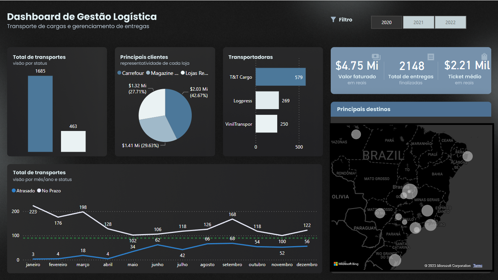
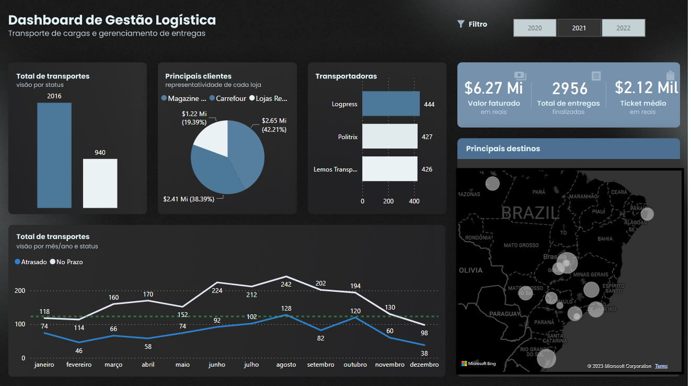
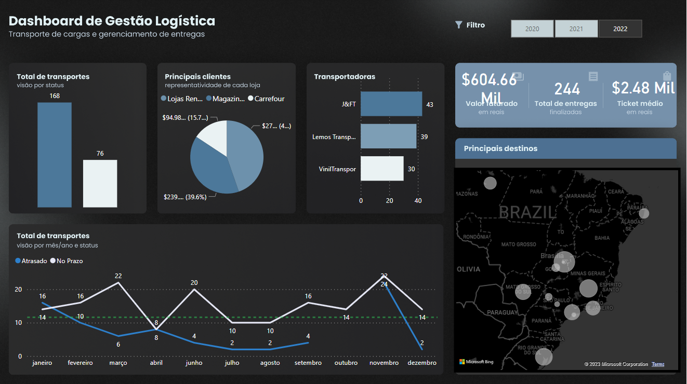

 # Curso PowerBI📕

## Atividade nível 1💡

- [x] Tarefa 1 - Criar um dashboard de Gestão Logística

## Laboratórios💻

- Tarefa 1 - Criar um dashboard de Gestão Logística - Transporte de cargas e gerenciamento de entegas

O dashbosrd usando uma base de dados fictícia e composto de informações sobre Total de transportes; Principais clientes; Transpostadoras; Total de transportes que foram entregues em atraso ou no dentro do prazo; principais destinos utilizando o gráfico de mapas, além de um filtro por ano (2020, 2021, 2022)

Dash filtrado no ano de 2020
 

Dash filtrado no ano de 2021
 

Dash filtrado no ano de 2022
 

- Link para acessar o Dashboard online

https://app.powerbi.com/view?r=eyJrIjoiYWMwMTFjNmItMjEzZS00NGE1LThhYzAtNTFlMTVmNmVmY2Q5IiwidCI6IjljODE4MTYwLTViY2ItNDg5MC05OWRiLTJhYWI1ODc3YmViMCJ9

