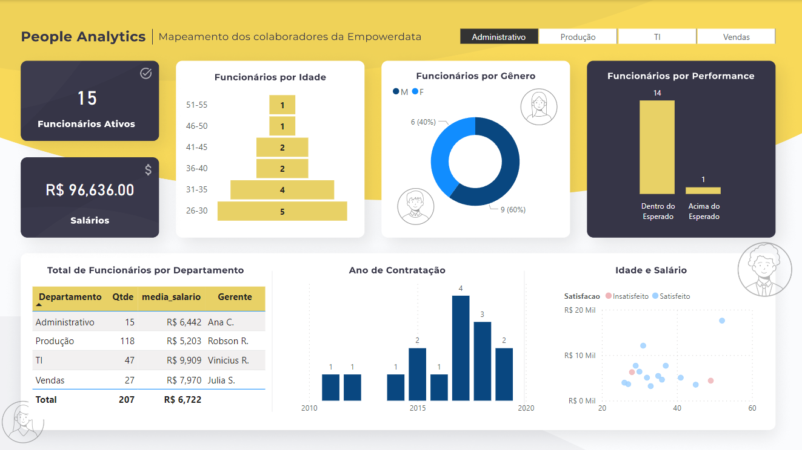
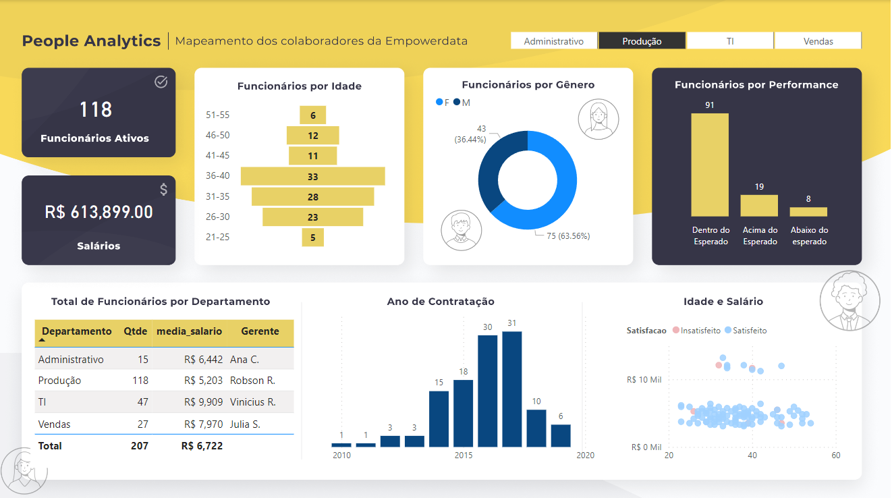
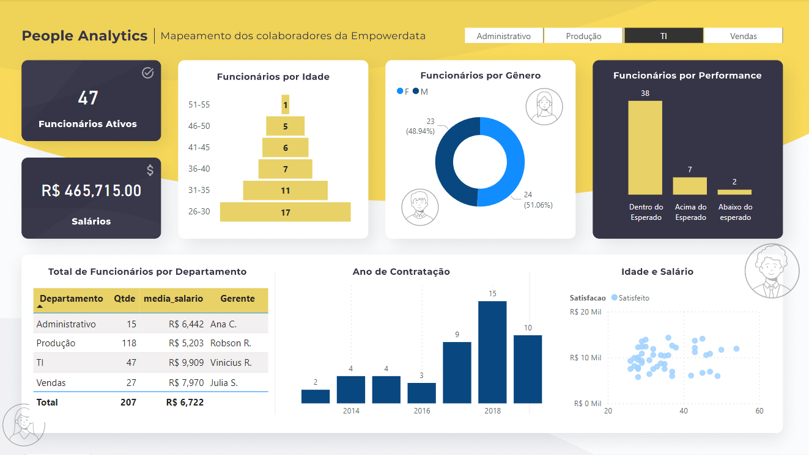
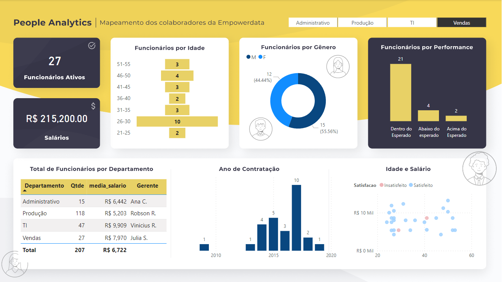

 # Curso PowerBI📕

## Atividade nível 💡

- [x] Tarefa 2 - Criar um dashboard de People Analytcis

## Laboratórios💻

- Tarefa 2 - Criar um dashboard de People Analytcis - Mapeando os colaborados de uma empresa fictícia

O dashbosrd foi criado usando uma base de dados fictícia e composto de informações sobre número de funcionário ativos; total de salários; Funcionários por idade; Funcionários por performance; Total de funcionários por departamento; ano de contratação; satisfação dos funcionários, e um filtro por setor da empresa.

Dash filtrado para Administrativo
 

Dash filtrado para Produção
 

Dash filtrado para TI
 

Dash filtrado para Vendas
 

- Link para acessar o Dashboard online

https://app.powerbi.com/view?r=eyJrIjoiMTM5NDA5YzQtZmE5Ny00OTc5LWE2NTAtZDQ5MjQwN2UyZjY0IiwidCI6IjljODE4MTYwLTViY2ItNDg5MC05OWRiLTJhYWI1ODc3YmViMCJ9