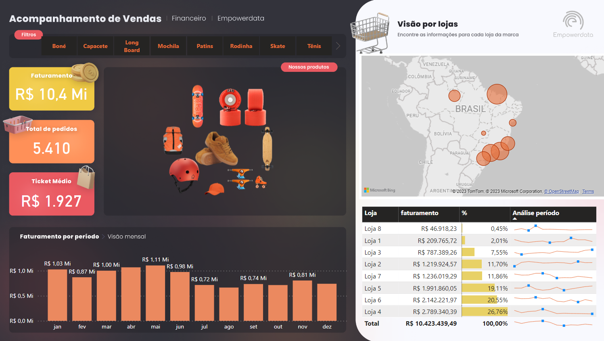
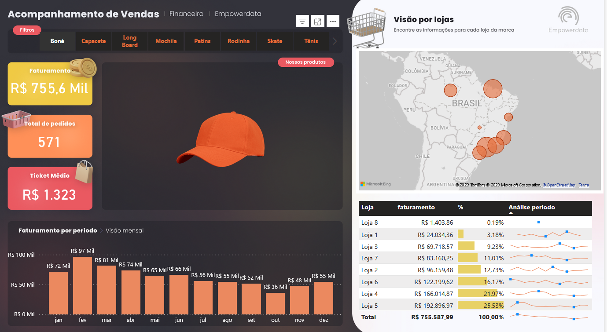
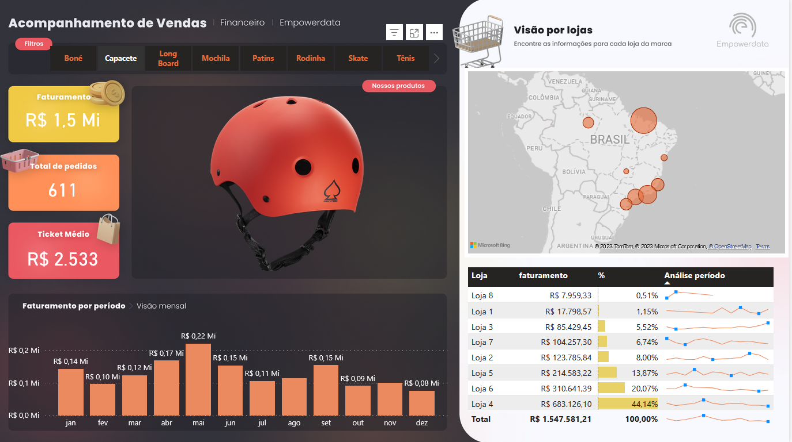
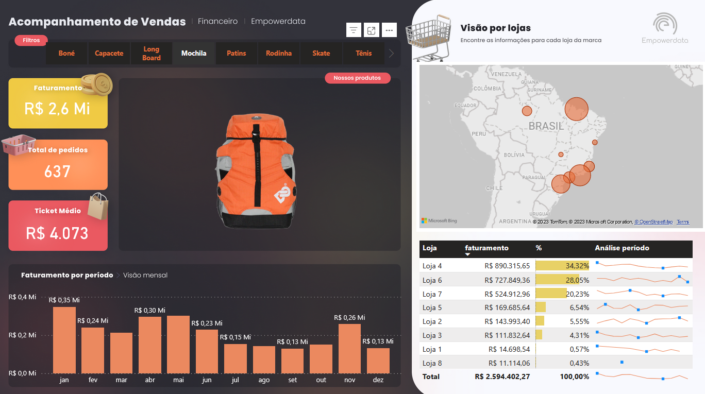
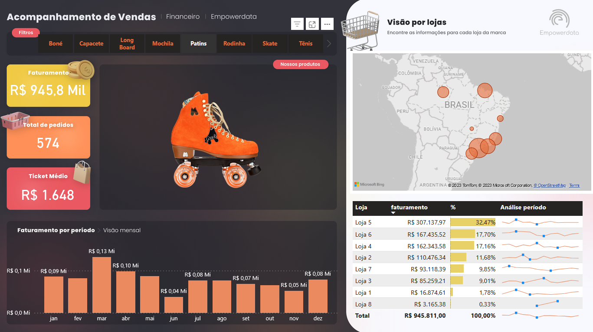
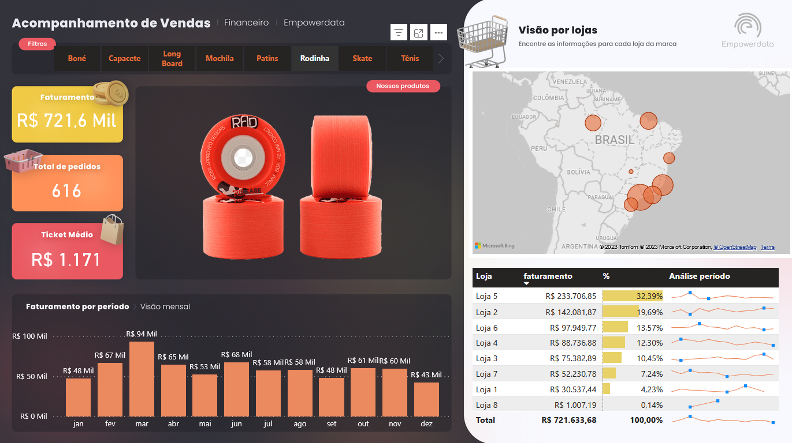
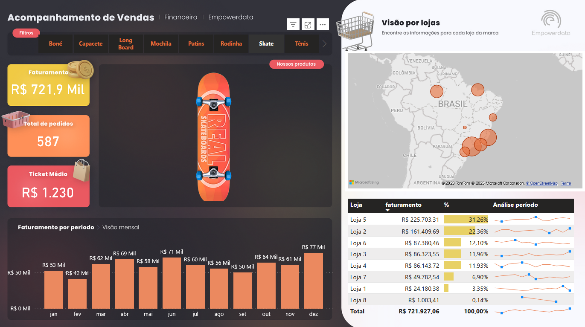
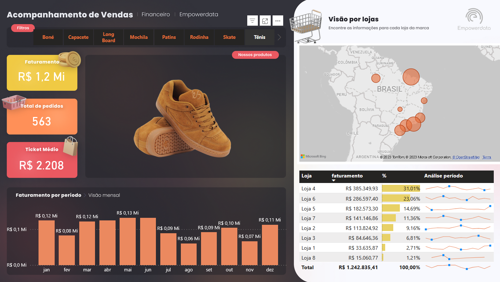

 # Curso PowerBI📕

## Atividade níve3 💡

- [x] Tarefa 3 - Criar um Dashboard de Vendas + Produtos interativos

## Laboratórios💻

- Tarefa 3 - Criar um Dashboard de Vendas + Produtos interativos de uma empresa fictícia

O dashbosrd foi criado usando uma base de dados fictícia e composto de informações sobre faturamento; total de pedidos; ticket médio; faturamento por período; mapa do Brasil onde eastão localizdas as lojas; uma tabela interativa com informações sobre cada loja como faturamento, porcentual de vendas e análise por período; filtro por produto; além de conter a imagem de cada produto.

Dash visão geral
 

Dash filtrado por boné
 

Dash filtrado por capacete
 

Dash filtrado por Long Board
 

Dash filtrado por mochila
 

Dash filtrado por patins
 

Dash filtrado por rodinhas
 

Dash filtrado por skate
 

Dash filtrado por tenis
 

- Link para acessar o Dashboard online

https://app.powerbi.com/view?r=eyJrIjoiZjVlMDFmOTctMDFkNS00YjQwLTg2M2UtNTc3ODc1ZGNmMWYxIiwidCI6IjljODE4MTYwLTViY2ItNDg5MC05OWRiLTJhYWI1ODc3YmViMCJ9
