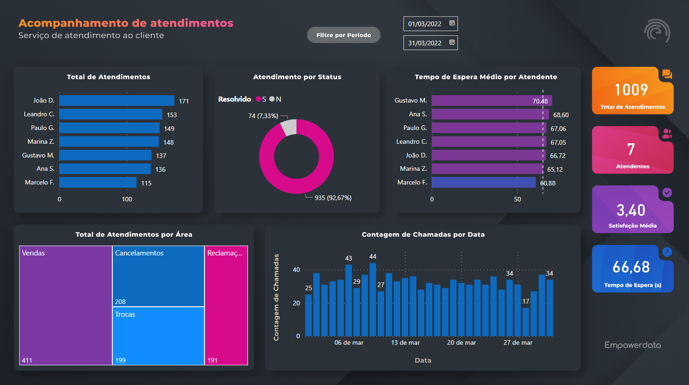

 # Curso PowerBI📕

## Atividade níve1 💡

- [x] Tarefa 4 - Criar um Dashboard de Atendimentos de Clientes

## Laboratórios💻

- Tarefa 4 - Criar um Dashboard de Atendimentos de Clientes

O dashbosrd foi criado usando uma base de dados fictícia. Apresenta as seguintes informações sobre total de atendimentos por atendente; atendimento por status (resolvido sim ou não); tempo de espera média por atendente; total de atendimentos por área; contagem de chamadas por data; toatal do tempo de espera em segundos: satisfação média; número de atendentes; total de atendimentos, além de um filtro por data.

Dash visão geral
 

- Link para acessar o Dashboard online

https://app.powerbi.com/view?r=eyJrIjoiZDMyMDNmZWYtMGMzZS00MDE5LWFhOWQtMjQwNDVhMjM5YjVlIiwidCI6IjljODE4MTYwLTViY2ItNDg5MC05OWRiLTJhYWI1ODc3YmViMCJ9
