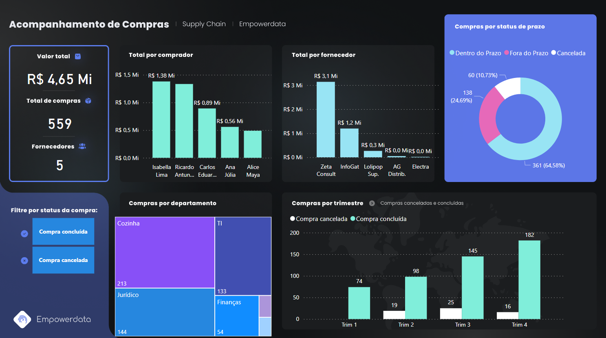

 # Curso PowerBI📕

## Atividade níve 1💡

- [x] Tarefa 5 - Criar um Dashboard de Acompanhamento de Compras

## Laboratórios💻

- Tarefa 5 - Criar um Dashboard de Acompanhamento de Compras

O dashbosrd foi criado usando uma base de dados fictícia. Apresenta as seguintes informações sobre valor total de compras; número total de compras; número de fornecedores; total por comprador; total por fornecedor; compras por departamento; compras por statu de prazo; compras por trimestre, além de um filtro por status de compra (concluída ou cancelada).

Dash visão geral
 

- Link para acessar o Dashboard online

https://app.powerbi.com/view?r=eyJrIjoiMDUwYWZjZTMtYTVjNS00NTAwLTgzZjYtM2JhMmE3Y2EzYjVkIiwidCI6IjljODE4MTYwLTViY2ItNDg5MC05OWRiLTJhYWI1ODc3YmViMCJ9