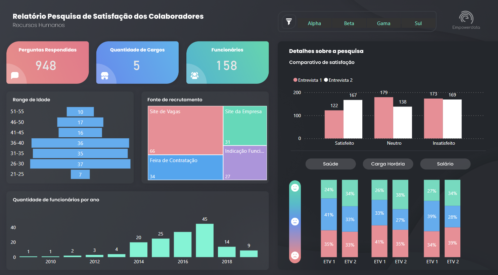

 # Curso PowerBI📕

## Atividade níve 2💡

- [x] Tarefa 6 - Criar um Dashboard de Pesquisa de Satisfação

## Laboratórios💻

- Tarefa 6 - Criar um Dashboard de Pesquisa de Satisfação de funcionários de uma empresa fictícia.

O dashbosrd foi criado usando uma base de dados fictícia. Apresenta as seguintes informações sobre número de perguntas respondidas; quantidade de cargos; número de fucionários que responderam a pesquisa; range de idade; fonte de recrutamento utilizada para a pesquisa; quantidade de funcionários por ano; detalhe sobre a pesquisa quanto ao nível de satisfação dos funcionários; filtro de safistação por campo (salário, carga horária e saúde).

Dash visão geral
 

- Link para acessar o Dashboard online

https://app.powerbi.com/view?r=eyJrIjoiYjA4OGYwOTktZGVjYi00ZWI2LWEwZTUtOTU0NThlNzM4ZDhiIiwidCI6IjljODE4MTYwLTViY2ItNDg5MC05OWRiLTJhYWI1ODc3YmViMCJ9