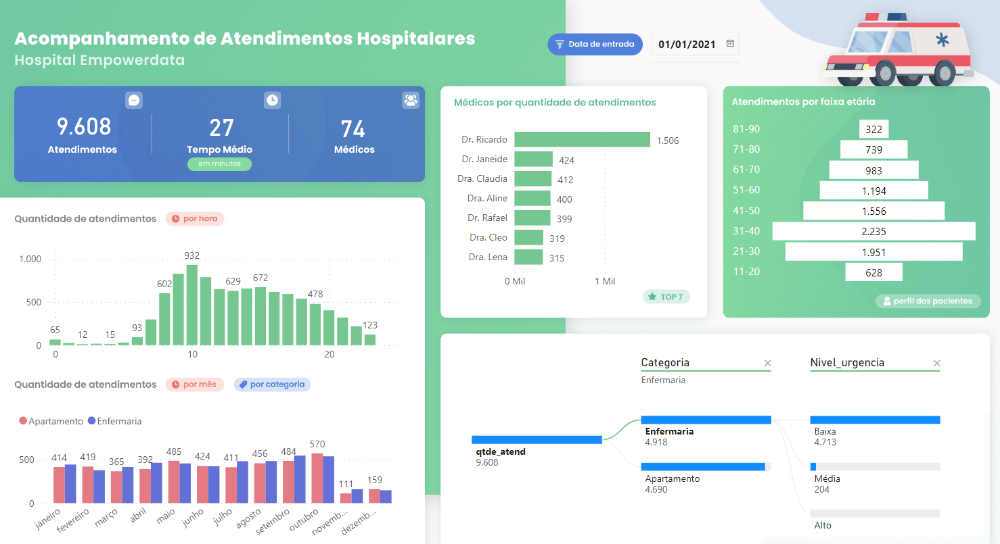

 # Curso PowerBI📕

## Atividade níve 2💡

- [x] Tarefa 7 - Criar um Dashboard de Atendimento Hospitalares

## Laboratórios💻

- Tarefa 7 - Criar um Dashboard de Atendimento Hospitalares.

O dashbosrd foi criado usando uma base de dados fictícia. Apresenta as seguintes informações sobre acompanhamento de atendimentos hsopitalares com número de atendimentos; tempo médio de atendimento em minutos; quantidade de médicos; atendimento por faixa etária; quantidade de atendimentos por hora; quantidade de atendimentos por mês/ categoria; relação de atendimentos por médico, além de quantidade de atendimento por categoria e nível de urgência.

Dash visão geral
 

- Link para acessar o Dashboard online

https://app.powerbi.com/view?r=eyJrIjoiZTRhNjM0YTQtNzlkZi00MTcwLWJkNDEtYjdhZWIzNzVhNjIxIiwidCI6IjljODE4MTYwLTViY2ItNDg5MC05OWRiLTJhYWI1ODc3YmViMCJ9