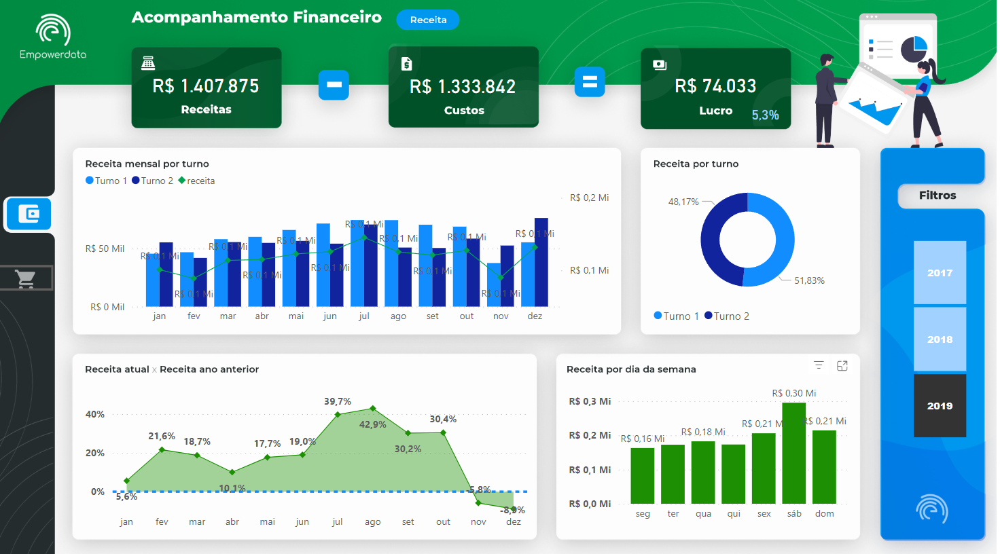
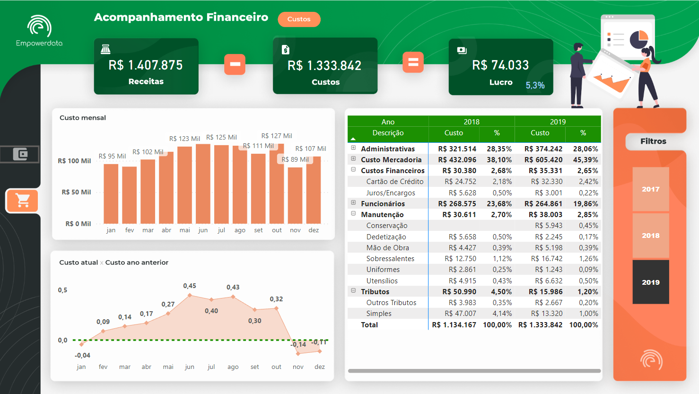

 # Curso PowerBI📕

## Atividade níve 3💡

- [x] Tarefa 8 - Criar um Dashboard de Financeiro

## Laboratórios💻

- Tarefa 8 - Criar um Dashboard de Financeiro de uma empresa fictícia.

O dashbosrd foi criado usando uma base de dados fictícia. Apresenta as seguintes informações: na aba receita; custo; lucro e porcentagem do lucro; filtro para cada ano; receita mensal por turno; receita por turno; receita atual x receita ano anterior e receita por dia da semana. Na aba custo; custo; lucro e porcentagem do lucro; filtro para cada ano; custo mensal; custo atual x custo ano anterior e uma tabela com a descrição dos setores contenco um filtro para cada setor, o custo e a porcentegem de cada setor, para os anos de 2018 e 2019.

Dash visão aba receita
 

Dash visão aba custo
 

- Link para acessar o Dashboard online

https://app.powerbi.com/view?r=eyJrIjoiZGE2YTljYmUtNTYwMi00Mzc5LThhZTgtNDFhYmZmZDlmMWI4IiwidCI6IjljODE4MTYwLTViY2ItNDg5MC05OWRiLTJhYWI1ODc3YmViMCJ9